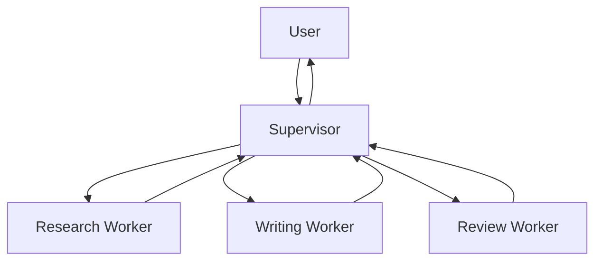
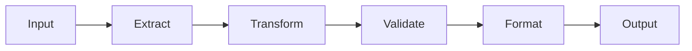
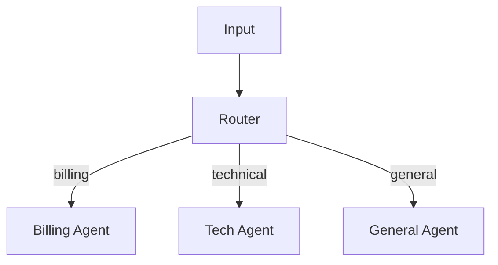

# Agent Patterns

Multi-agent architectures and when to use each.

## When to Split into Multiple Agents
- Different tools needed per subtask
- Different system prompts / personas needed
- Different models optimal (cheap classifier + expensive generator)
- Error isolation required (one agent failing shouldn't crash others)
- Different security boundaries (PII-handling agent isolated)

## Pattern 1: Supervisor

One agent orchestrates, delegates to workers, aggregates results.



```python
def supervisor(state):
    plan = completion(model="gpt-4o", messages=[
        {"role": "system", "content": "Decide next worker: research, write, review, or DONE"},
        *state["messages"]
    ])
    return {"next": plan.choices[0].message.content}
```

**Use when**: dynamic task planning, unknown number of steps.

## Pattern 2: Pipeline

Sequential agents, each transforms and passes forward.



**Use when**: fixed stages, each stage has clear input/output contract.

## Pattern 3: Router

Classify input, delegate to specialist.



**Use when**: input types vary, specialists needed. Often Level 3 on complexity ladder.

## Pattern 4: Peer-to-Peer Handoff

Agents transfer control with full context.

```python
class Handoff:
    target_agent: str
    context: str  # Why handing off
    state: dict   # Shared state to transfer
```

**Use when**: conversation needs to move between domains (sales -> support -> billing).

## Pattern 5: Crew (Role-Based)

Agents with distinct roles collaborate toward shared goal.

- **Manager**: plans, assigns, reviews
- **Researcher**: gathers information
- **Writer**: produces content
- **Critic**: evaluates quality

**Use when**: creative/research tasks needing multiple perspectives.

## Communication Patterns

| Pattern | Mechanism | Latency |
|---------|-----------|---------|
| Shared state | Common state dict/DB | Low |
| Message passing | Queue/events | Medium |
| Tool calling | Agent A calls Agent B as tool | Low |
| Artifact passing | Agent A writes file, Agent B reads | High |

## Anti-Patterns
- **Chatty agents**: agents talking to each other in loops without progress
- **Single point of failure**: supervisor crashes, everything stops
- **State confusion**: agents overwriting each other's state
- **Over-splitting**: 10 agents for a task that needs 2
