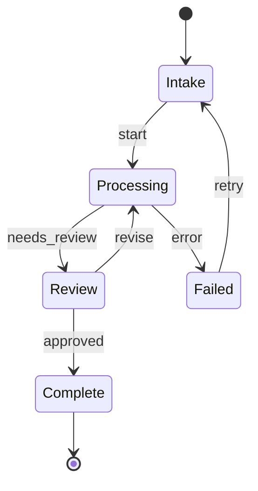

# State Machine Patterns

State management for multi-step, resumable, and human-in-the-loop agents.

## When You Need State Management
- Multi-step workflows (order processing, onboarding)
- Resumable tasks (pick up where you left off after crash)
- Human-in-the-loop (pause for approval, resume after)
- Long-running agents (minutes/hours, not seconds)

## Simple State Machine (No Framework)

```python
from dataclasses import dataclass, field
from enum import Enum

class Status(str, Enum):
    INTAKE = "intake"
    PROCESSING = "processing"
    REVIEW = "review"
    COMPLETE = "complete"
    FAILED = "failed"

TRANSITIONS = {
    Status.INTAKE: [Status.PROCESSING, Status.FAILED],
    Status.PROCESSING: [Status.REVIEW, Status.FAILED],
    Status.REVIEW: [Status.COMPLETE, Status.PROCESSING],
    Status.COMPLETE: [],
    Status.FAILED: [Status.INTAKE],
}

@dataclass
class AgentState:
    status: Status = Status.INTAKE
    data: dict = field(default_factory=dict)
    history: list = field(default_factory=list)

    def transition(self, new_status: Status):
        if new_status not in TRANSITIONS[self.status]:
            raise ValueError(f"Cannot go from {self.status} to {new_status}")
        self.history.append({"from": self.status, "to": new_status})
        self.status = new_status
```

## LangGraph State

```python
from typing import TypedDict, Annotated
from operator import add
from langgraph.graph import StateGraph, START, END

class ClaimState(TypedDict):
    messages: Annotated[list, add]
    claim_id: str
    status: str
    extracted_data: dict

graph = StateGraph(ClaimState)
graph.add_node("extract", extract_info)
graph.add_node("validate", validate_claim)
graph.add_node("decide", make_decision)

graph.add_edge(START, "extract")
graph.add_edge("extract", "validate")
graph.add_conditional_edges("validate", route_validation, {
    "valid": "decide",
    "invalid": "extract"
})
graph.add_edge("decide", END)
```

## Checkpointing

```python
from langgraph.checkpoint.memory import MemorySaver
from langgraph.checkpoint.postgres import PostgresSaver

# Development
app = graph.compile(checkpointer=MemorySaver())

# Production
checkpointer = PostgresSaver.from_conn_string("postgresql://...")
app = graph.compile(checkpointer=checkpointer)

# Run with thread ID for resumability
config = {"configurable": {"thread_id": "claim-123"}}
result = app.invoke(initial_state, config)

# Resume later
result = app.invoke(None, config)
```

## Human-in-the-Loop with interrupt()

```python
from langgraph.types import interrupt, Command

def review_node(state):
    decision = interrupt({
        "question": "Approve this claim?",
        "claim_data": state["extracted_data"],
        "options": ["approve", "reject", "request_more_info"]
    })
    return {"status": decision}

# Resume with human input
app.invoke(Command(resume="approve"), config)
```

## State Diagram Template (Mermaid)


