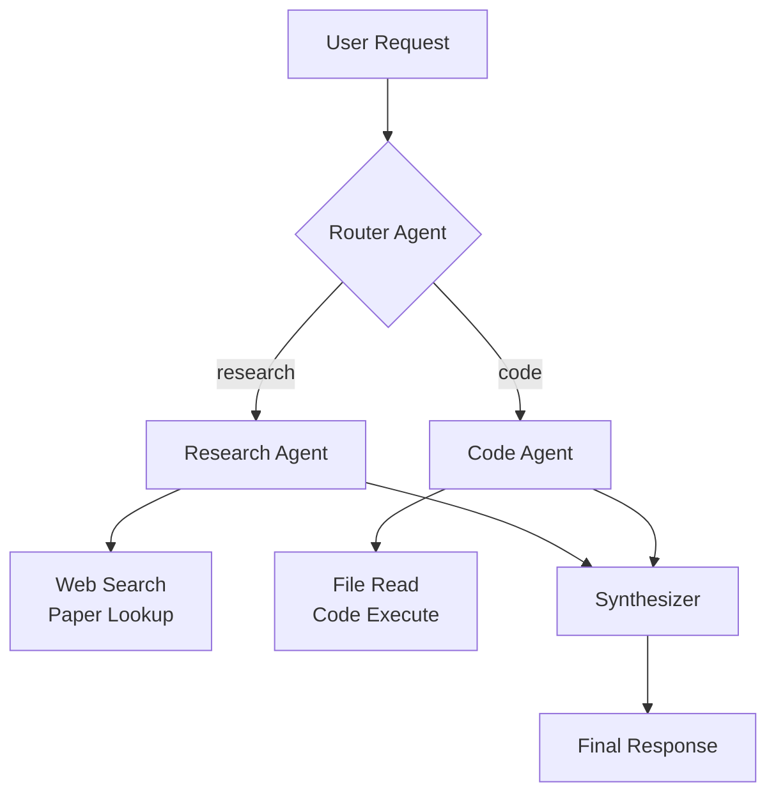
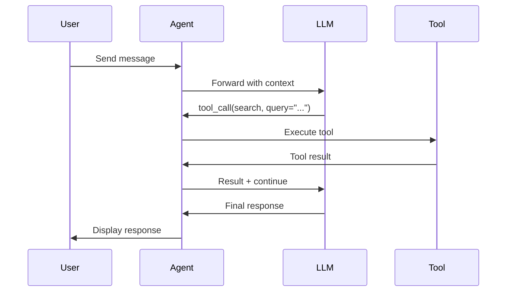

# Documenting AI Systems

Generate comprehensive documentation for AI agent systems.

## Instructions

### Step 1: Identify documentation scope
Route to the correct reference:
- API documentation → `references/api-doc-templates.md`
- Architecture diagrams → `references/mermaid-patterns.md`
- Agent flow documentation → `references/agent-flow-docs.md`
- Operations runbook → `references/runbook-template.md`

If user asks for "full docs" or "document the system", generate all four.

### Step 2: Read relevant reference
Load the needed template. Then analyze the codebase — read source files to understand agents, tools, API endpoints, data flows, and dependencies.

### Step 3: Generate architecture diagram
Every AI system doc should include at least one Mermaid diagram. Example agent flow:

Sequence diagram for tool calling:

### Step 4: Generate documentation content
For each doc type, include:

**README** — Project overview, quickstart, architecture diagram, API summary, env vars
**API docs** — Endpoints, request/response examples, error codes, auth, rate limits
**Agent flow** — Agent roles, tool list, handoff logic, state transitions, failure modes
**Runbook** — Common operations, troubleshooting, monitoring, incident response

### Step 5: Write docs
- Place in `docs/` directory alongside the project
- Or write to `.claude/artifacts/documenting-{name}.md`
- Use Mermaid for all diagrams (renders in GitHub, most doc platforms)
- Include concrete examples (API request/response, sample agent interaction)

## Documentation quality checklist
- [ ] Architecture diagram present (Mermaid)
- [ ] All agents and their roles documented
- [ ] Tool list with descriptions and risk levels
- [ ] API endpoints with request/response examples
- [ ] Environment variables documented
- [ ] Setup instructions that actually work
- [ ] Failure modes and recovery steps covered
- [ ] No stale information (matches current codebase)
