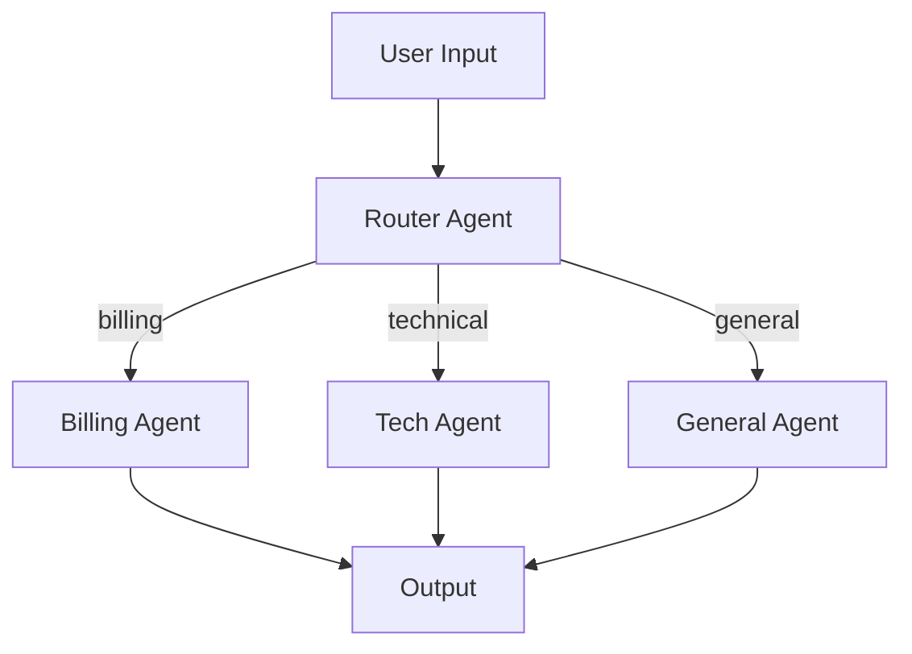
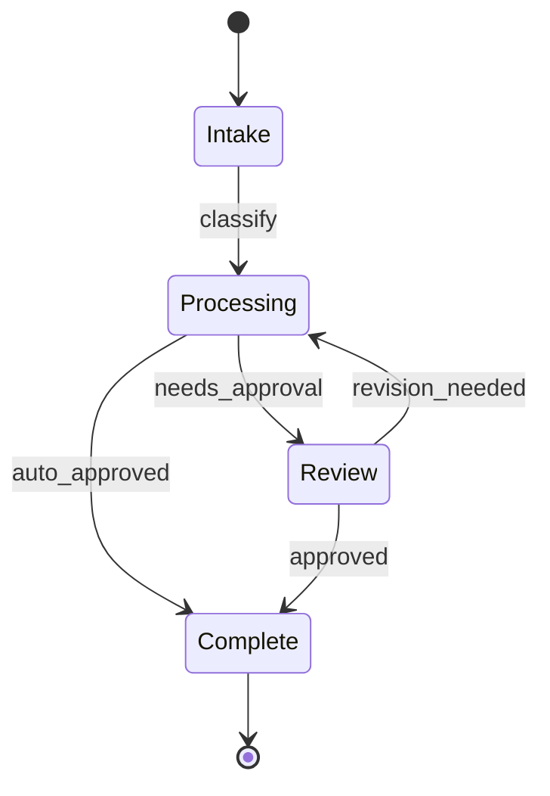
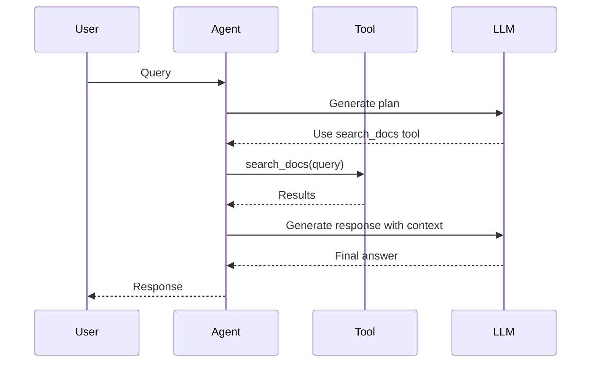
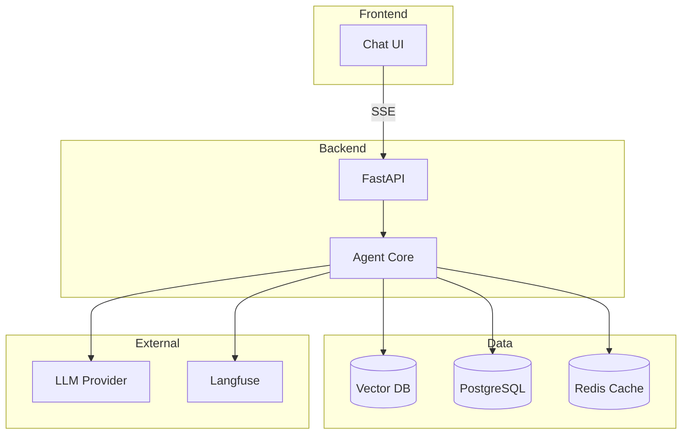
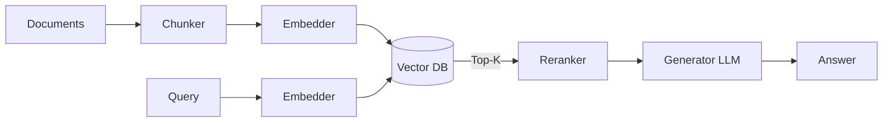

# Mermaid Diagram Patterns for AI Systems

## Agent Flow (Flowchart)

## State Machine

## Sequence Diagram (Agent-Tool Interaction)

## System Architecture

## RAG Pipeline

## Tips
- Use `flowchart` for agent routing and data flow
- Use `stateDiagram-v2` for state machines
- Use `sequenceDiagram` for request/response flows
- Use `graph TB/LR` for system architecture
- Keep diagrams focused — one concept per diagram
